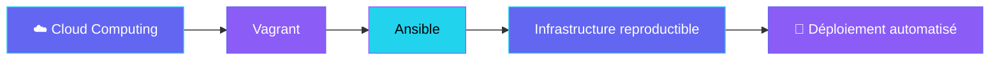

<div align="center">

<!-- Bannière animée -->


<!-- Typing animation -->
<a href="https://git.io/typing-svg">
  
</a>

<br/><br/>

[](https://github.com/KEVINBMK)
[](https://github.com/KEVINBMK)
[](https://github.com/KEVINBMK?tab=repositories)

</div>

---

## 🚀 À propos

```diff
+ Étudiant en Ingénierie Logicielle
+ Passionné par le Cloud Computing & l'automatisation d'infrastructures
+ Coordination technique & intégration de projets en équipe
+ Toujours en train d'apprendre, de construire et de partager
```

<br/>

<div align="center">

### 🛠️ Stack technique

<a href="https://skillicons.dev">
  
</a>

</div>

<br/>

---

## 📊 Statistiques GitHub

<div align="center">


<br/><br/>


<br/><br/>


</div>

---

## 🏆 Trophées

<div align="center">


</div>

---

## 🌟 Projets en vedette

<div align="center">

| Projet | Description | Stack |
|:------:|:------------|:------|
| [**CloudVagrantProject**](https://github.com/KEVINBMK/CloudVagrantProject) | Infrastructure virtualisée automatisée — TP Cloud Computing | `Vagrant` `Ansible` `VirtualBox` |
| [**Portfolio**](https://github.com/KEVINBMK/Portfolio) | Portfolio personnel | `HTML` `CSS` |
| [**plateform_presence_qr_beta**](https://github.com/KEVINBMK/plateform_presence_qr_beta) | Plateforme de présence par QR code | `Web` |
| [**Billetterie_event**](https://github.com/KEVINBMK/Billetterie_event) | Système de billetterie événementielle | `C++` |

</div>

<br/>

<div align="center">

[](https://github.com/KEVINBMK/CloudVagrantProject)
[](https://github.com/KEVINBMK/Portfolio)

</div>

---

## 🐍 Contributions

<div align="center">

<!-- Snake animé — généré automatiquement par GitHub Actions -->
<picture>
  <source media="(prefers-color-scheme: dark)" srcset="https://raw.githubusercontent.com/KEVINBMK/KEVINBMK/output/github-contribution-grid-snake-dark.svg">
  <source media="(prefers-color-scheme: light)" srcset="https://raw.githubusercontent.com/KEVINBMK/KEVINBMK/output/github-contribution-grid-snake.svg">
  
</picture>

</div>

---

## 💡 Ce sur quoi je travaille



---

## 📫 Me contacter

<div align="center">

[](https://github.com/KEVINBMK)
<!-- Remplace les liens ci-dessous par tes vrais contacts -->
[](mailto:TON_EMAIL@exemple.com)
[](https://www.linkedin.com/in/TON_PROFIL)

</div>

<br/>

<div align="center">

<!-- Footer animé -->


**⭐ Si tu aimes mon travail, n'hésite pas à mettre une étoile sur mes repos !**

*Dernière mise à jour : Juin 2026*

</div>
